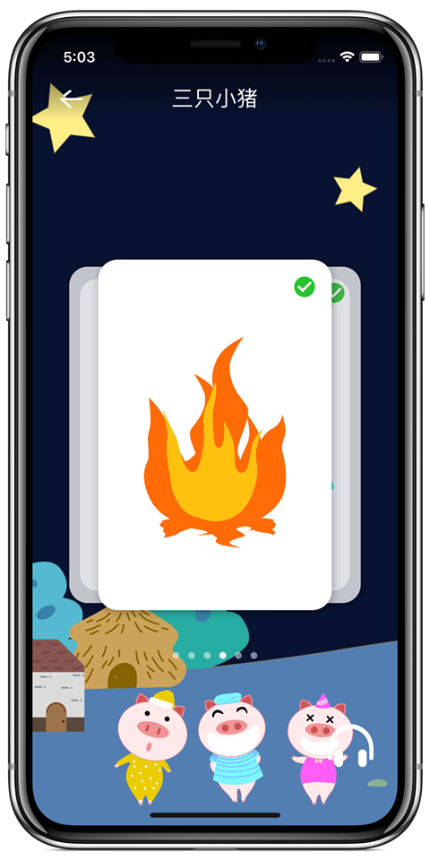
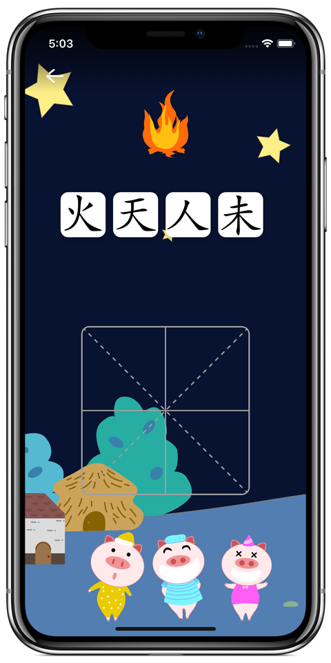
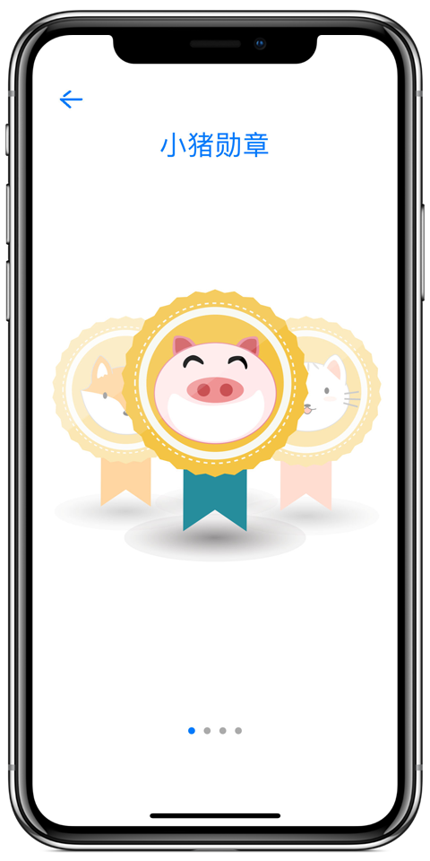

# 活字 huozi

[项目页面](https://celestialphineas.github.io/huozi)

> 字有颜如玉，字有黄金屋。

教育应用示例，通过动画和拼字帮助儿童学习汉字。主要特性：

* 矢量动画的展示
* 儿童拼汉字的交互
* iCloud同步用户数据

## 简介

汉字是活的、有灵性、有生命的，同时也是中国传统文化的载体，因此我们将产品命名为“活字”。“活字”让小朋友们看到了“活”的汉字，每一个汉字都有对应的象形小动画，动画的原型是象形文字，这增强了学习内容的趣味性和小朋友学习汉字的积极性，让他们从小能够热爱汉字、理解汉字，从而更好地传承中华传统文化。
“活字”将汉字所承载的信息融入到引人入胜的故事中，小朋友学会了每个故事中所要求掌握的汉字之后，可以获得故事勋章、生动的故事讲解。更重要的是，小朋友可以在解锁故事的经历中获得学习的成就感。
